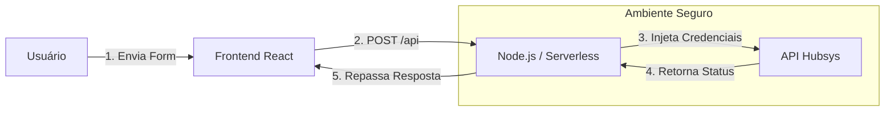

# 🌍 Journey360 — Landing Page & Lead Integration


## 🧠 Arquitetura (BFF)

A arquitetura **Backend-for-Frontend** garante que:

- O frontend **nunca** consuma a API Hubsys diretamente
- As credenciais ficam isoladas no backend
- Headers sensíveis são tratados apenas no servidor
- O controle de CORS é totalmente resolvido

## 🎯 Objetivo do Projeto

- Disponibilizar uma landing page moderna e performática
- Centralizar integrações com a API Hubsys de forma segura
- Evitar exposição de tokens e credenciais no frontend
- Permitir deploy tanto em **Serverless** quanto em **VPS**

## 🛠️ Stack Tecnológica

- **Frontend:** React + Vite
- **Estilização:** TailwindCSS
- **Backend:** Node.js (Express / Serverless Functions)
- **Deploy Serverless:** Vercel
- **Deploy Tradicional:** VPS + PM2 + Nginx
- **Gerenciamento de Processos:** PM2
- **Proxy Reverso:** Nginx
- **SSL:** Certbot (Let's Encrypt)


### Fluxo de Dados (BFF)



---

## 🗂️ Estrutura do Projeto

O código é híbrido, suportando deploy tanto em Vercel quanto em VPS.

```text
journey360/
├── .env                  # Variáveis de ambiente (NÃO COMITAR)
├── api/                  # Backend Serverless (Exclusivo Vercel)
├── deploy.sh             # Script de Deploy Automático (VPS)
├── dist/                 # Build de produção (Gerado automaticamente)
├── public/               # Assets estáticos
├── src/                  # Código fonte Frontend (React)
├── server.js             # Servidor Node.js (Exclusivo VPS)
├── vite.config.js        # Configuração Vite (Proxy Local)
└── package.json          # Dependências
```

---

## 🔑 Variáveis de Ambiente

Crie um arquivo `.env` na raiz do projeto:

```env
# Credenciais Hubsys
HUBSYS_API_STATIC_USER=seu-usuario
HUBSYS_API_STATIC_TOKEN=seu-token
HUBSYS_API_STATIC_PASSWORD=sua-senha-hash-md5

# Porta do Servidor (Obrigatório apenas para VPS)
PORT=3000
```

⚠️ **Segurança:** Nunca suba este arquivo para o GitHub.

---

## 💻 Desenvolvimento Local

```bash
npm install
npm run dev
```

O projeto rodará em `http://localhost:3000` com proxy gerenciado pelo Vite.

---

## 🚀 Deploy

### Opção 1: Vercel (Recomendado)

1. Suba o projeto no GitHub  
2. Importe o repositório na Vercel  
3. Configure as variáveis de ambiente  
4. Faça o deploy  

---

### Opção 2: VPS (Automático)

```bash
chmod +x deploy.sh
sudo ./deploy.sh
```

O script instala Node.js, Nginx, PM2 e configura SSL opcionalmente.

---

### Opção 3: VPS (Manual)

```bash
sudo apt install nodejs npm nginx -y
sudo npm install -g pm2
git clone <SEU_REPO>
cd journey360
npm install
nano .env
npm run build
pm2 start server.js --name journey360
pm2 save
```

---

## 🐛 Troubleshooting

**403 Forbidden**  
→ Verifique credenciais e ambiente (DSV2 / UAT)

**Headers not set**  
→ Use `X-USER` e `X-TOKEN`

**502 Bad Gateway (VPS)**  
→ Verifique `pm2 status` e `pm2 logs`

---

## 📄 Licença

Projeto desenvolvido para fins institucionais.
